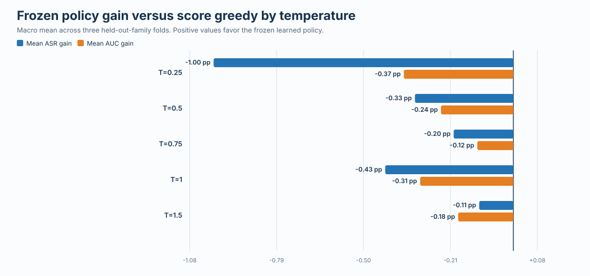
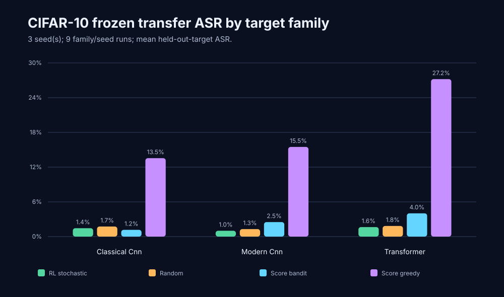

# DeepPoly & RL Attack Transferability

Research code for two related robustness directions:

- **Certified robustness:** DeepPoly bound propagation and adversarial-game training for neural networks.
- **Attack transferability:** a recurrent reinforcement-learning attacker trained on frozen source model families and evaluated, without further learning, on a held-out victim family.

The transferability work asks a specific question: can an RL attack policy learn reusable attack behavior from multiple source architectures, then transfer to an unseen target architecture under a fixed query budget?

> Current status: RTX Phase 1 completed all **30 family/seed cells**, Phase 2 Stage B completed all **3 development cells and 12 source conditions**, and the post-Stage-B D0 diagnostic completed all **3 folds and 60 temperature-condition blocks**. The source gates failed, no tested temperature repaired the learned policy, and the complete RTX workflow made **zero hidden-target attack calls**.

## RTX Phase 1 and Phase 2 results

Phase 1 used three leave-one-family-out folds, ten policy seeds, a fixed verified victim bank, behavior cloning from a privileged source-gradient teacher, GroupDRO PPO, component ablations, and matched black-box controls. The full source phase took 16.26 hours.

| Source-side method | ASR at 50 calls | ASR/query AUC |
| --- | ---: | ---: |
| Hybrid BC + GroupDRO + PPO | 7.05% | 3.25% |
| BC only | 6.86% | 3.10% |
| PPO only | 5.69% | 2.55% |
| Score greedy | 5.61% | 2.47% |
| Random action | 5.60% | 2.46% |

The hybrid policy improved over score greedy by 1.45 percentage points in ASR and 0.78 points in AUC, but the preregistered gate required gains of 5 and 2 points in every source condition. Behavior-cloning validation accuracy was 2.84%, below the 2.95% majority baseline. PPO added only 0.20 ASR points over BC alone, and the 5,000-episode training curve did not improve after its early portion. The evidence therefore points to a representation and teacher-objective problem, not a shortage of PPO episodes.

The checksum-backed evidence bundle contains all 30 run summaries, every source condition, raw numerical result rows and query traces in compressed form, figures, training diagnostics, and input artifact hashes:

- [RTX Phase 1 evidence and interpretation](docs/research/cifar10_rtx_phase1/README.md)
- [Phase 2 preregistered source protocol](docs/research/cifar10_rtx_phase2_protocol.md)

Phase 2 tested a richer patch-statistics observation, normalized soft-gradient distillation, and a shared action-conditioned actor. Stage B used one development seed across all three folds, 600 BC episodes and 600 scheduled PPO episodes per cell, authenticated Phase 1 source victims, and 100 source-evaluation images per cell.

| Phase 2 Stage B measure | Observed | Required |
| --- | ---: | ---: |
| Mean ASR gain over score greedy | -0.43 points | +1.00 point |
| Mean ASR-query AUC gain | -0.31 points | +0.50 points |
| Mean soft top-5 gain over validation oracle | -3.99 points | +1.00 point |
| Mean soft cross-entropy improvement | -0.0488 | +0.0200 |
| Conditions positive on both ASR and AUC | 1 / 12 | at least 9 / 12 |
| Strict source gates passed | 0 / 3 | diagnostic only |


The stochastic learned policy reached 6.01% macro source ASR, compared with 6.44% for score greedy and 6.12% for random action. Its deterministic deployment reached only 0.83%. The primary failure is therefore not a lack of attack events. It is a failure to learn a source policy that is better calibrated and more query-efficient than strong matched controls.

The complete Git-safe evidence bundle includes every raw numerical result row, sampled query trace, source condition, victim accuracy, BC diagnostic, PPO block, runtime component, and artifact hash:

- [RTX Phase 2 Stage B evidence and interpretation](docs/research/cifar10_rtx_phase2_stage_b/README.md)
- [Deadline-aware source-only next steps](docs/research/cifar10_rtx_phase2_next_steps.md)

### Post-Stage-B calibration diagnostic

The bounded D0 diagnostic replayed the three completed, frozen Phase 2 checkpoints at five sampling temperatures. It completed 9,000 source result rows and 376,142 source-model calls in 12 minutes 21 seconds on an RTX 2080 Ti. All temperature-1.0 rows reproduced the verified Phase 2 evidence exactly.

| Frozen method | Macro source ASR | Macro ASR/query AUC | Gain over score, ASR / AUC |
| --- | ---: | ---: | ---: |
| Score greedy | 6.435% | 2.995% | reference |
| Temperature 0.25 | 5.432% | 2.628% | -1.003 / -0.366 points |
| Temperature 0.50 | 6.106% | 2.752% | -0.329 / -0.242 points |
| Temperature 0.75 | 6.236% | 2.874% | -0.200 / -0.120 points |
| Temperature 1.00 | 6.007% | 2.683% | -0.429 / -0.312 points |
| Temperature 1.50 | 6.321% | 2.810% | -0.114 / -0.185 points |



No temperature matched score-greedy ASR and AUC in every fold. Temperature 0.75 improved both metrics only in the transformer-held-out fold, while all five temperatures remained below score greedy on both metrics in the modern-CNN-held-out fold. The predeclared rule therefore closes this five-value global-temperature repair for the frozen seed-17 checkpoints. It does not establish the underlying cause; a baseline-preserving residual ranker is the next exploratory screen.

- [RTX Phase 2 calibration evidence, figures, and interpretation](docs/research/cifar10_rtx_phase2_calibration/README.md)

Stage C and target evaluation were not run because the locked Stage B gate failed. The full 90 MB archive, including policy and victim checkpoints, is retained locally under `output/rl_transfer/cifar10_rtx_phase2_screen`. Recreate the compact evidence bundle with:

```bash
uv run python scripts/export_phase2_evidence.py

uv run python scripts/export_phase2_calibration_evidence.py \
  --attempt-log output/rl_transfer/cifar10_rtx_phase2_calibration.log \
  --attempt-log output/rl_transfer/cifar10_rtx_phase2_calibration.rerun.log
```

The following commands reproduce or resume the locked Phase 2 screen. Neither command has a target-evaluation mode.

```bash
uv run python -m rl_transfer.phase2_temperature_cli \
  --phase1-manifest output/rl_transfer/cifar10_rtx_publication/cifar10-rtx-publication/study_manifest.json \
  --phase1-root output/rl_transfer/cifar10_rtx_publication/cifar10-rtx-publication \
  --output-dir output/rl_transfer/cifar10_rtx_phase2_stage_a \
  --data-root data/cifar10 \
  --deadline-seconds 600

uv run python -m rl_transfer.phase2_screen_cli \
  --config configs/rl_transfer/cifar10_rtx_phase2_screen.json \
  --dry-run

uv run python -m rl_transfer.phase2_screen_cli \
  --config configs/rl_transfer/cifar10_rtx_phase2_screen.json

uv run python -m rl_transfer.phase2_calibration_cli \
  --source-manifest output/rl_transfer/cifar10_rtx_phase2_screen/screen_manifest.json \
  --source-root output/rl_transfer/cifar10_rtx_phase2_screen \
  --output-dir output/rl_transfer/cifar10_rtx_phase2_calibration \
  --data-root data/cifar10 \
  --deadline-seconds 900
```

A positive screen authorizes only a larger source-only replication. It does not authorize a target claim. Target evaluation remains sealed until the final source gate passes.

## M4 CIFAR-10 pilot results

The completed pilot trained the attacker only on a Classical CNN and a Modern CNN. It then froze the attacker and evaluated it against a held-out Patch Transformer (ViT-like) victim.


### Experiment setup

| Item | Pilot value |
| --- | --- |
| Dataset | CIFAR-10 |
| Hardware | Apple M4 using PyTorch MPS |
| Wall-clock time | 6 min 12 s |
| Source victim families | Classical CNN and Modern CNN |
| Held-out target family | Patch Transformer |
| RL policy | Recurrent PPO with GroupDRO source-family weighting |
| Policy training | 400 scheduled episodes, 205 trainable episodes, 5,261 source-model calls |
| Target attack budget | 25 total target queries, \(L_\infty\) epsilon = 8/255 |
| Evaluation denominator | 99 clean-correct target images |

All victim models cleared the deliberately modest pilot-quality gate before attack evaluation.


| Victim family | Validation accuracy | Pilot gate |
| --- | ---: | ---: |
| Classical CNN | 66.3% | 60% |
| Modern CNN | 53.4% | 50% |
| Patch Transformer | 42.5% | 40% |

### Frozen transfer result


| Method on held-out Patch Transformer | Successful attacks | ASR at 25 queries | ASR/query AUC |
| --- | ---: | ---: | ---: |
| Fixed action | 1 / 99 | 1.0% | 0.9% |
| Frozen RL policy, deterministic | 2 / 99 | 2.0% | 1.8% |
| Frozen RL policy, stochastic | 5 / 99 | 5.1% | 2.5% |
| Random action | 7 / 99 | 7.1% | 3.9% |

The policy **was frozen** during target evaluation: its SHA-256 digest was unchanged before and after deployment. However, stochastic RL reached 5.1% ASR while random reached 7.1%, so this experiment does **not** demonstrate an RL transfer advantage. The right next step is stronger target/victim fitting followed by multiple seeds and confidence intervals—not a stronger claim from one pilot.

Read the full visual report in [docs/research/cifar10_m4_pilot_summary.md](docs/research/cifar10_m4_pilot_summary.md). The committed raw aggregate is [cifar10_m4_pilot_results.json](docs/research/cifar10_m4_pilot_results.json).

## Upgraded three-seed cross-victim study

The upgraded iteration directly addresses the first pilot's failure modes:

- dense confidence-margin rewards replace sparse true-class-score rewards;
- two independently initialized victims are rotated inside each source family;
- GroupDRO remains family-level and records calls for every source model;
- all three leave-one-family-out directions are supported;
- query-matched random and score-bandit controls are joined by a custom patch-based, SimBA-style score-greedy control;
- three-seed aggregation uses paired Student-t intervals, minimum practical gains, per-seed entropy checks, and a fail-closed promotion gate;
- every promotion input is revalidated for frozen policy digests, identical eligible samples, exact query budgets, and internally consistent ASR/AUC;
- victim checkpoints are shared across folds with fitting-code/backend contracts, independent fit seeds, checksum verification, and writer locks;
- every policy block records family/instance eligibility, successes, returns, margin reductions, GroupDRO losses, weights, and source calls.

The full clean-revision run used an Apple M4 with PyTorch MPS and finished in **1 h 54 min**:



| Study item | Completed value |
| --- | --- |
| Held-out folds | Classical CNN, Modern CNN, Transformer |
| Fresh seeds | 17, 29, 41 |
| Independent victim instances | 18 across all seeds; two per source family and one held-out target per run |
| Policy training | 5,400 scheduled episodes; 3,640 trainable sequences; 91,800 source-model calls |
| Frozen target evaluation | 1,859 clean-correct image/run cases |
| Threat model | 25 total score queries, including initialization; L∞ = 8/255 |
| Promotion result | **Fail** in every held-out family; all victim-quality gates passed |

Victim fitting was materially stronger and stable across seeds:

| Victim family | Validation accuracy range | Gate | Target-test accuracy range |
| --- | ---: | ---: | ---: |
| Classical CNN | 73.4–74.4% | 60% | 73.3–78.7% |
| Modern CNN | 73.3–76.2% | 50% | 70.7–79.3% |
| Transformer | 51.1–56.3% | 40% | 53.0–58.3% |

Mean final attack success rate across the three fresh seeds:

| Held-out target | Stochastic RL | Random | Score bandit | Score greedy |
| --- | ---: | ---: | ---: | ---: |
| Classical CNN | 1.45% | 1.74% | 1.17% | **13.55%** |
| Modern CNN | 1.01% | 1.29% | 2.50% | **15.49%** |
| Transformer | 1.65% | 1.84% | 4.02% | **27.20%** |

The result is clear for this setup: dense-reward GroupDRO PPO did **not** learn a transferable advantage. Its normalized action entropy stayed near random (0.988–0.994), while the custom patch-based score-greedy attack was consistently much stronger under the same total query budget. This argues for changing the RL state/action/reward design or testing matched ablations before spending on larger compute—not for claiming that transfer attacks fail generally.

See the [full visual report](docs/research/cifar10_m4_study_summary.md), [verified compact results](docs/research/cifar10_m4_study_results.json), and [one-seed diagnostic](docs/research/cifar10_m4_study_quick_summary.md). Results generated before the score-greedy, RNG-provenance, and rollout-offset fixes are intentionally excluded because they are scientifically superseded.

## Run it locally

### Install

```bash
uv sync --extra vision --extra analysis --extra notebook --extra test
```

### Validate the codebase

```bash
uv run pytest -q
```

### Fast M4 feasibility run

This is the short configuration for verifying the full pipeline on a Mac. It is intentionally too small for scientific conclusions.

```bash
uv run python -m rl_transfer.cifar_cli \
  --config configs/rl_transfer/cifar10_m4_quick.json \
  --device auto
```

### Bounded M4 pilot

```bash
uv run python -m rl_transfer.cifar_cli \
  --config configs/rl_transfer/cifar10_m4_pilot.json \
  --device auto
```

The runner detects MPS automatically, checkpoints every victim and policy block, and resumes only when the configuration, deterministic split, and package-code fingerprint match. Run artifacts and checkpoints are written to `output/rl_transfer/` and are intentionally not committed.

### Three-fold diagnostic

```bash
uv run python -m rl_transfer.cifar_study_cli \
  --config configs/rl_transfer/cifar10_m4_study_quick.json \
  --device auto
```

### Three-seed study

This is the longer resumable run. It evaluates all three held-out families for fresh seeds 17, 29, and 41; seed 7 is reserved for development diagnostics.

```bash
uv run python -m rl_transfer.cifar_study_cli \
  --config configs/rl_transfer/cifar10_m4_study.json \
  --device auto
```

### Notebook and report

- [notebooks/cifar10_mac_pilot.ipynb](notebooks/cifar10_mac_pilot.ipynb) — train or inspect an M4 run interactively.
- [notebooks/cifar10_m4_study.ipynb](notebooks/cifar10_m4_study.ipynb) — inspect cross-fold, multi-seed aggregates and promotion gates.
- [docs/research/cifar10_m4_pilot_summary.md](docs/research/cifar10_m4_pilot_summary.md) — rendered figures and result interpretation.
- [docs/research/cifar10_m4_study_summary.md](docs/research/cifar10_m4_study_summary.md) — corrected nine-fold result with per-seed time, victim accuracy, and control ASR.
- Regenerate the figures after recording a new manifest:

```bash
uv run python -m rl_transfer.pilot_report \
  --input docs/research/cifar10_m4_pilot_results.json \
  --output-dir docs/research

uv run python -m rl_transfer.study_report \
  --input output/rl_transfer/cifar10_m4_studies/cifar10-m4-study/study_manifest.json \
  --output-dir docs/research
```

## Repository guide

| Area | Where to look |
| --- | --- |
| DeepPoly MNIST certification | [deeppoly_mnist.ipynb](deeppoly_mnist.ipynb) |
| PGD + DeepPoly adversarial game | [adversarial_game.py](adversarial_game.py) |
| Cross-victim RL attack harness | [rl_transfer/](rl_transfer) |
| M4 pilot configuration | [configs/rl_transfer/](configs/rl_transfer) |
| Legacy DQN transfer prototype | [rl_attack_transfer.ipynb](rl_attack_transfer.ipynb) |
| Research plan | [docs/research/rl_cross_victim_research_plan.pdf](docs/research/rl_cross_victim_research_plan.pdf) |
| Broader research directions | [research_areas.md](research_areas.md), [research_idea.md](research_idea.md), and [rl_attack_transfer_proposal.md](rl_attack_transfer_proposal.md) |
| Speech attack prototype | [speech_adversarial_attack.ipynb](speech_adversarial_attack.ipynb) |

## Research protocol notes

The RL attacker is never allowed to train on, tune against, or update during evaluation on the held-out target family. Every target call—including initialization and failed attempts—counts toward the total target-query budget. Lower-budget results are computed from each same full attack trajectory rather than by giving separate runs more chances.

The upgraded study still uses one dataset and one held-out target instance per family/seed. Broader architecture populations, nested family-level model selection, matched component ablations, and more seeds are required before making a general transferability claim.

The upgraded study is still exploratory: it changes reward shaping, victim population size, and family weighting together, so it cannot attribute any improvement to one component without matched ablations. MPS determinism is requested in warning mode, but some operators remain nondeterministic; checkpoint hashes are therefore the exact artifact identity even when fit seeds match.

## References

- DeepPoly: Singh et al., POPL 2019 — <https://github.com/eth-sri/eran>
- PGD adversarial training: Madry et al., ICLR 2018
- \(\alpha\beta\)-CROWN: Wang et al., NeurIPS 2021
