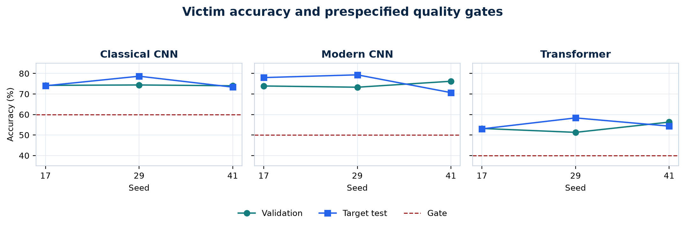

# Executive Summary

Across nine experiments, our trained reinforcement learning agent did not beat simple attack methods on unseen model families. The current PPO agent therefore needs more work before it can be presented as a transferable attack method. The results also show us what to test next.

We studied a different kind of adversarial transfer. Most transfer attacks create an adversarial image on one model and test that same image on another model. In our work, the transferred object is an attack policy. The policy learns how to choose a sequence of small image changes by observing the target model's confidence scores.

We trained the policy on two model families and tested it on a third family that was not used during training. We repeated this process for three target families and three random seeds, giving nine complete runs. During target testing, the policy was frozen. Its weights and optimizer state were not changed.

The main results were:

- PPO reached an average attack success rate between 1.01% and 1.65%.
- Random actions reached between 1.29% and 1.84%.
- A score-greedy search reached between 13.55% and 27.20%.
- PPO action entropy stayed between 0.988 and 0.994, which is very close to uniform random action selection.

> **Main takeaway:** The experiment pipeline worked, the target models passed their quality checks, and the frozen-policy rule was maintained. However, the current PPO design did not learn a useful transferable attack strategy.

The complete study ran on an Apple M4 MacBook in about 114 minutes. This run time shows that we can develop and test the current CIFAR-10 experiments locally before using larger compute.

# 1. Project Goal

## 1.1 Problem we wanted to study

Image classifiers can change their prediction after a small and carefully chosen change to the input image [1], [2]. When the attacker can see the model's gradients, this is called a white-box attack. In our project, the attacker cannot see gradients, model weights, internal features, or training data. It can only send an image to the model and read the output scores.

Our main question was:

> Can an attack policy learn from several source models, remain fully frozen, and still attack a model from an unseen architecture family better than simple controls?

This question is about policy transfer, not only adversarial-image transfer. A successful policy would learn a search strategy that remains useful when the victim architecture changes.

## 1.2 Two learning modes in the project

The codebase supports two separate ideas:

1. **Frozen transfer:** Train the policy on source models, freeze it, and test it on a target model without any parameter updates.
2. **Target adaptation:** Copy the source policy and continue training the copy on a separate target adaptation set.

The final CIFAR-10 study in this report evaluates only frozen transfer. The target-adaptation path was implemented earlier with a DQN prototype and tested at software level, but it was not included as a final scientific comparison. We therefore do not claim that continual learning improved the attack.

# 2. What We Built

## 2.1 Target model families

We used three compact CIFAR-10 model families:

- A residual classical CNN
- A depthwise modern CNN
- A patch transformer

These models are custom research models. They are not standard pretrained ResNet, ConvNeXt, or ViT checkpoints.

For every experiment, one family was held out as the target. The other two families were used as sources. Each source family had two independently trained model instances. This reduced the chance that the policy would learn behavior from only one model.

## 2.2 The attack agent

The main agent is a recurrent actor-critic trained with Proximal Policy Optimization, or PPO [4]. A GRU memory allows the agent to use the sequence of target responses within one attack episode.

At each step, the agent receives eight simple values. These include:

- The rank of the true class
- The model's prediction entropy
- The change in the true-class score
- The margin between the true class and the strongest competing class
- The remaining query budget
- The previous action and reward
- The progress through the episode

The image is divided into 16 patches. An action chooses one patch, one colour channel, and one direction. This gives 96 possible actions. Each PPO action changes the selected region by 2/255.

Every image is kept inside an L-infinity limit of 8/255. In simple terms, no pixel can move more than 8 values on a 0 to 255 image scale. The code applies this limit after every action.

## 2.3 Training across model families

The policy training schedule balances the source families. We also use GroupDRO [5] to give more weight to a source family when the policy performs poorly on it. The aim is to reduce overfitting to the easier source family.

The reward gives the agent credit when it reduces the margin between the correct class and the strongest competing class. It gives an extra reward when the prediction changes and applies a small cost for every query.

## 2.4 Comparison methods

We compared PPO with three controls:

- **Random:** Chooses from the same 96 actions uniformly.
- **Score bandit:** Uses rewards observed earlier in the same image attack.
- **Score greedy:** Tests patch directions and keeps a change only when the prediction margin improves.

Score greedy uses the same patch direction catalogue, image set, final perturbation limit, and total query budget. However, each greedy proposal moves directly by 8/255, while PPO moves by 2/255 per action. This difference must be considered when reading the comparison.

# 3. Experiment Setup

## 3.1 Leave-one-family-out design

We ran three target-family settings:

1. Train on modern CNN and transformer models, then test on a classical CNN.
2. Train on classical CNN and transformer models, then test on a modern CNN.
3. Train on classical and modern CNN models, then test on a transformer.

Each setting was repeated with seeds 17, 29, and 41. This produced nine trained policies and nine target evaluations.

| Setting | Value |
| --- | --- |
| Dataset | CIFAR-10 |
| Target families | Classical CNN, modern CNN, transformer |
| Seeds | 17, 29, 41 |
| Source models | Two families with two models per family |
| Policy training | 600 scheduled episodes per run |
| Target images | 300 test images per run |
| Query budget | 25 total target calls, including initialization |
| Attack limit | L-infinity, 8/255 |
| Hardware | Apple M4 using PyTorch MPS |

## 3.2 Fairness and integrity checks

We added checks to make sure the comparison was valid:

- Every method used the same target images in a run.
- Attack success was measured only on images classified correctly before the attack.
- Every target call counted toward the same limit of 25.
- Query checkpoints came from one attack trajectory.
- A SHA-256 digest was checked before and after target evaluation.
- The policy, optimizer state, and configuration had to remain unchanged.
- The full family and seed grid had to be complete.

These checks reduce the risk of target-data leakage or unfair query counting.

## 3.3 Compute used

The full experiment scheduled 5,400 policy episodes and recorded 91,800 source-model calls. It evaluated 1,859 clean-correct target image and run cases per method. The total wall-clock time was 6,864.9 seconds, or about 114.4 minutes.

> **Local compute result:** The current CIFAR-10 study completed on the Apple M4 in about 114 minutes. We can run the same-scale diagnostic experiments locally. Larger datasets and standard ImageNet models will need more memory and compute.

# 4. Results

## 4.1 Target model quality

All target models passed the configured accuracy gates. This check rules out poorly trained victim models as the main reason for the attack result.

| Model family | Validation accuracy | Target test accuracy |
| --- | --- | --- |
| Classical CNN | 73.4% to 74.4% | 73.3% to 78.7% |
| Modern CNN | 73.3% to 76.2% | 70.7% to 79.3% |
| Transformer | 51.1% to 56.3% | 53.0% to 58.3% |

The transformer accuracy was lower than the CNN accuracy, so the results should not be treated as evidence for large production vision transformers. Still, every model passed its quality threshold.

## 4.2 Final attack success rate

Attack success rate, or ASR, is the percentage of eligible images for which the attack changed the model's prediction.

| Held-out target family | PPO | Random | Score bandit | Score greedy |
| --- | --- | --- | --- | --- |
| Classical CNN | 1.45% | 1.74% | 1.17% | 13.55% |
| Modern CNN | 1.01% | 1.29% | 2.50% | 15.49% |
| Transformer | 1.65% | 1.84% | 4.02% | 27.20% |

PPO did not beat random in any target family. Score greedy achieved the highest average ASR in every family.

Across all nine runs, PPO succeeded on 25 of 1,859 eligible cases. Random succeeded on 30, score bandit on 45, and score greedy on 333.

## 4.3 Success across the query budget

We also measured the area under the ASR versus query curve. This shows whether a method succeeds early or needs most of its query budget.

| Held-out target family | PPO AUC | Random AUC | Bandit AUC | Greedy AUC |
| --- | --- | --- | --- | --- |
| Classical CNN | 0.81% | 0.96% | 0.79% | 6.52% |
| Modern CNN | 0.53% | 0.62% | 1.48% | 7.17% |
| Transformer | 0.78% | 0.91% | 2.33% | 13.19% |

The PPO curve remained close to random throughout the query budget. It was not simply slower at the start and better by query 25.

## 4.4 Action behaviour

The normalized entropy of PPO's executed actions was between 0.988 and 0.994. A value near 1.0 means that the action histogram is close to uniform.

This does not prove that every policy output was exactly random. The measured entropy exceeded the promotion-rule maximum of 0.95 in every run.

## 4.5 Promotion decision

The promotion rule failed for all three held-out target families. It failed because PPO did not improve ASR or query efficiency over the controls and because its action entropy was too high.

The failure was not caused by missing runs, changed target policies, invalid victim models, or mismatched query budgets.

# 5. What the Results Mean

## 5.1 What worked

The pipeline completed all planned checks:

- Training and frozen target evaluation completed for all nine runs.
- The Apple M4 handled the full CIFAR-10 study.
- Target policies stayed frozen.
- Query counting and eligible-image checks passed.
- Victim models passed their accuracy gates.
- Results can be rebuilt from saved run records.
- The repository test suite passed 76 tests and 12 subtests.

We can reuse this tested pipeline for the next experiments.

## 5.2 What did not work

The current PPO agent did not learn a useful attack strategy that transferred to unseen model families. Its ASR and query efficiency stayed close to random, and its action choices stayed close to a uniform distribution.

The score-greedy result shows that the target scores contain useful information and that patch search can work under the same overall budget. However, the larger greedy step means that PPO and score greedy do not use exactly the same action operator.

## 5.3 Likely reasons

The experiment suggests several possible problems:

- The 96-action space may be too large for the amount of successful training data.
- The eight-value observation does not include image-region features.
- Successful source attacks may be too rare for PPO to learn a clear signal.
- The entropy bonus may keep the policy too exploratory.
- The reward teaches confidence reduction, but not the accept-or-reject behaviour used by score greedy.

These are possible explanations, not confirmed causes. We need controlled experiments to separate them.

# 6. Recommended Next Work

## 6.1 Check source-task learning first

Before training a larger model, test each saved policy at three levels:

1. The exact source models used during training
2. New model instances from a source family
3. The held-out target family

If PPO fails on the exact source models, then transfer is not yet the main problem. If it works on the source models but fails on new instances, it has learned model-specific behaviour. If it works on new source-family instances but fails on the held-out family, then we have isolated a true family-transfer problem.

## 6.2 Learn from the stronger greedy method

Use score-greedy source trajectories as demonstrations. First train the policy with behavioural cloning so that it can imitate useful accepted actions. Then fine-tune it with PPO.

This tests whether imitation provides a better starting point than random initialization.

## 6.3 Improve the action and observation design

After the source-learning check, test:

- A hierarchical action space that chooses the patch, channel, direction, and step size separately
- A small image encoder that provides region-level information
- A lower entropy coefficient
- A matched greedy baseline that uses the same 2/255 step as PPO
- Reward ablations that separate confidence reduction from final attack success

## 6.4 Evaluate target adaptation separately

Once the frozen policy shows clear source competence, compare it with a cloned target-adaptation policy. The source policy must remain unchanged, and the target adaptation images must be separate from the final test images.

This experiment can answer whether limited target learning improves performance. It should not be called continual learning until retention across a sequence of tasks is also measured.

# 7. Limitations

The current study is exploratory:

- It uses CIFAR-10 rather than ImageNet.
- It uses custom compact models rather than standard pretrained architectures.
- It uses three seeds.
- Each family and seed has one held-out target instance.
- The budget is limited to 25 target calls.
- The baseline set does not yet include full Square Attack, SimBA-DCT, NES, or HopSkipJump implementations.
- The final study does not compare frozen transfer with target adaptation.
- Student-t intervals over three seeds are wide.
- One PyTorch MPS operation is not fully deterministic.

These results apply only to the tested setup. We should not claim that RL attack policies cannot transfer in general.

# 8. Responsible Use

This project is intended for authorized robustness research. Experiments should use public benchmarks or systems that the researcher owns or has permission to test.

The repository should share evaluation code, aggregate results, limits, and reproducibility details. Pretrained attack policies need additional review before public release because a reusable attack policy could reduce the effort needed to probe an unknown system.

# 9. Conclusion

We built and tested a complete frozen-policy attack-transfer pipeline on three CIFAR-10 model families. The study was technically successful: all nine runs completed, target policies stayed frozen, query accounting was consistent, and the target models passed their quality checks.

The research hypothesis was not supported. The current PPO policy stayed close to random, did not beat random in any family, and failed the prespecified control comparisons. Score-greedy search performed much better, although it used a larger action step.

We should not scale the same PPO design yet. First, we should confirm source-task learning, use greedy demonstrations for behavioural cloning, and test smaller controlled changes to the state, action, reward, and entropy settings.

We now have a tested baseline and a specific plan for the next phase of the research.

# Appendix A. Reproducibility Files

The main project files are:

- `configs/rl_transfer/cifar10_m4_study.json`: full experiment configuration
- `configs/rl_transfer/cifar10_m4_iteration.json`: per-run settings
- `docs/research/cifar10_m4_study_results.json`: verified compact results
- `notebooks/cifar10_m4_study.ipynb`: interactive analysis
- `MODEL_CARD_RL_ATTACK.md`: responsible-use notes
- `docs/research/cross_victim_rl_attack_transfer_paper.pdf`: academic paper version

The final study code revision was `2eb481a`. The first results publication revision was `9453730`.

# References

[1] C. Szegedy et al., "Intriguing Properties of Neural Networks," ICLR, 2014.

[2] I. J. Goodfellow, J. Shlens, and C. Szegedy, "Explaining and Harnessing Adversarial Examples," ICLR, 2015.

[3] C. Guo et al., "Simple Black-box Adversarial Attacks," ICML, 2019.

[4] J. Schulman et al., "Proximal Policy Optimization Algorithms," arXiv:1707.06347, 2017.

[5] S. Sagawa et al., "Distributionally Robust Neural Networks for Group Shifts," ICLR, 2020.

[6] A. Krizhevsky, "Learning Multiple Layers of Features from Tiny Images," University of Toronto, 2009.
