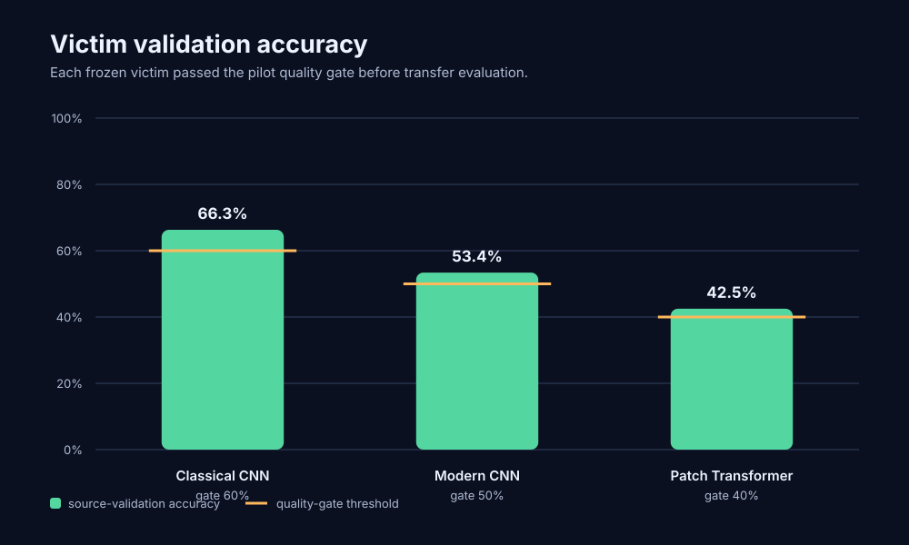
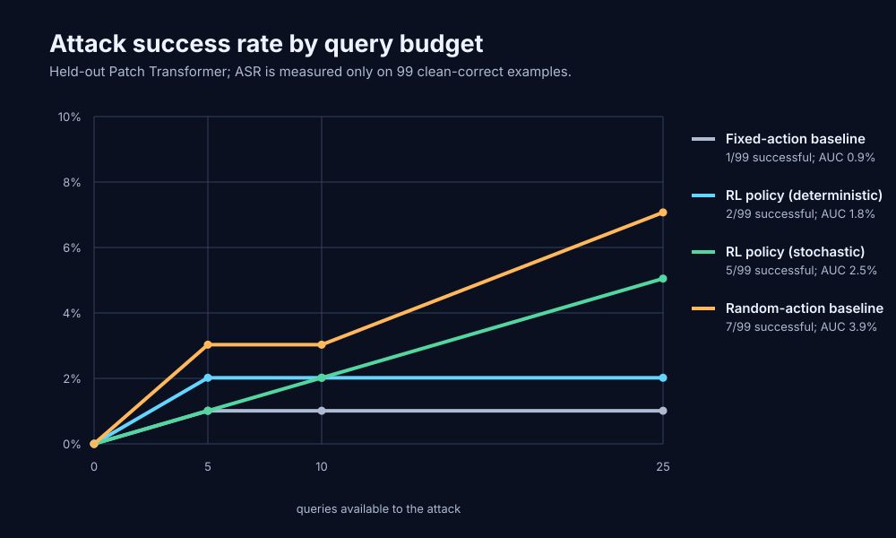
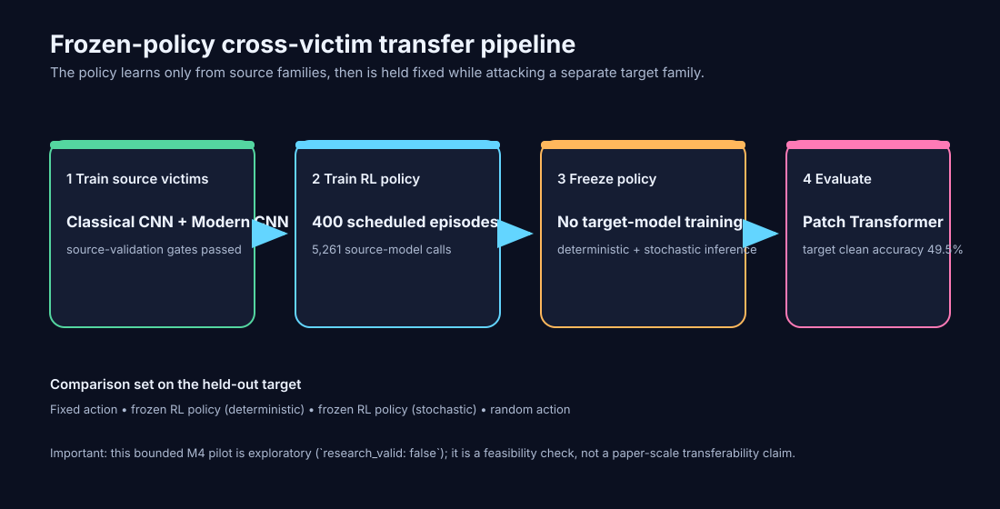

# CIFAR-10 M4 pilot — visual results

**Status:** exploratory pilot (`research_valid: false`). Generated from `docs/research/cifar10_m4_pilot_results.json`.







## What ran on the Mac

- Device: `mps`; elapsed wall time: **6 min 12 s (372.3 s)**.
- Three victim families were trained, then frozen. The recurrent GroupDRO/PPO policy was scheduled for **400 episodes**; the manifest reports **205 trained episodes** and **5,261 source-model calls**.
- Transfer evaluation attacked the held-out Patch Transformer. Its clean outer-test accuracy was **49.5%**; only the **99** clean-correct samples were eligible for ASR.

## Victim quality before the attack

| Family | Victim | Source validation accuracy | Gate |
| --- | --- | ---: | ---: |
| Classical CNN | `cifar_residual_cnn` | 66.3% | 60% |
| Modern CNN | `cifar_depthwise_cnn` | 53.4% | 50% |
| Patch Transformer | `cifar_patch_transformer` | 42.5% | 40% |

## Held-out transfer attack results

| Method | Successful / eligible | Final ASR | ASR/query AUC | ASR @ 0 | ASR @ 5 | ASR @ 10 | ASR @ 25 |
| --- | ---: | ---: | ---: | ---: | ---: | ---: | ---: |
| Fixed-action baseline | 1/99 | 1.0% | 0.9% | 0.0% | 1.0% | 1.0% | 1.0% |
| RL policy (deterministic) | 2/99 | 2.0% | 1.8% | 0.0% | 2.0% | 2.0% | 2.0% |
| RL policy (stochastic) | 5/99 | 5.1% | 2.5% | 0.0% | 1.0% | 2.0% | 5.1% |
| Random-action baseline | 7/99 | 7.1% | 3.9% | 0.0% | 3.0% | 3.0% | 7.1% |

## Readout

At the recorded 25-query budget, the strongest RL variant was stochastic inference at **5.1%** (5/99 successful). The random baseline reached **7.1%** (7/99), so this run does **not** show an RL transfer advantage. It does show that the full frozen-policy, cross-family evaluation pipeline executes end-to-end on the M4.

The trained victim accuracies cleared the configured pilot gates, but the held-out target was only 49.5% accurate. This result should therefore guide the next experiment—stronger victim training, more seeds, and confidence intervals—not be treated as a general attack-transfer conclusion.

## Reproduce the figures

```bash
uv run python -m rl_transfer.pilot_report \
  --input docs/research/cifar10_m4_pilot_results.json \
  --output-dir docs/research
```
