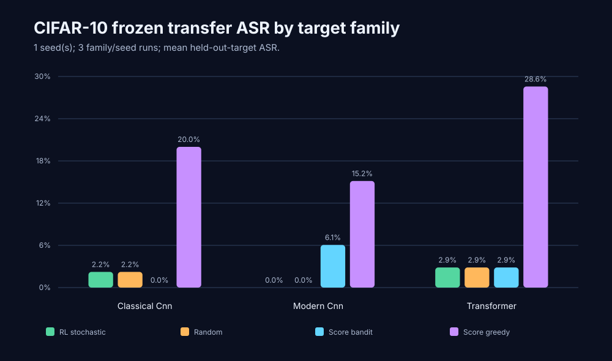

# CIFAR-10 cross-victim RL study

Status: exploratory (`research_valid: false`). Runtime: **4.8 minutes**.

| Held-out target | Seed | Time | Val. acc. / gate | Test acc. | Eligible | RL stochastic | Random | Score bandit | Score greedy | Victim gate |
| --- | ---: | ---: | ---: | ---: | ---: | ---: | ---: | ---: | ---: | --- |
| classical_cnn | 7 | 2.8m | 38.0% / ≥60.0% | 45.0% | 45 | 1/45 (2.2%) | 1/45 (2.2%) | 0/45 (0.0%) | 9/45 (20.0%) | fail |
| modern_cnn | 7 | 1.2m | 28.3% / ≥50.0% | 33.0% | 33 | 0/33 (0.0%) | 0/33 (0.0%) | 2/33 (6.1%) | 5/33 (15.2%) | fail |
| transformer | 7 | 0.9m | 26.3% / ≥40.0% | 35.0% | 35 | 1/35 (2.9%) | 1/35 (2.9%) | 1/35 (2.9%) | 10/35 (28.6%) | fail |

## Across-seed mean ASR

| Held-out target | RL stochastic | Random | Score bandit | Score greedy |
| --- | ---: | ---: | ---: | ---: |
| classical_cnn | 2.22% | 2.22% | 0.00% | 20.00% |
| modern_cnn | 0.00% | 0.00% | 6.06% | 15.15% |
| transformer | 2.86% | 2.86% | 2.86% | 28.57% |

## Interpretation

The study completed 3 run(s) across 3 held-out target family/families and 1 unique seed(s). The promotion gate did not pass because fewer than three aligned seeds are available; one or more victim-quality gates failed; at least one fold failed the paired RL-versus-control criterion; at least one fold failed the per-seed RL entropy criterion. All reported target attacks use frozen deployment and a shared total query budget; the results remain exploratory and should not be treated as a publication claim.
