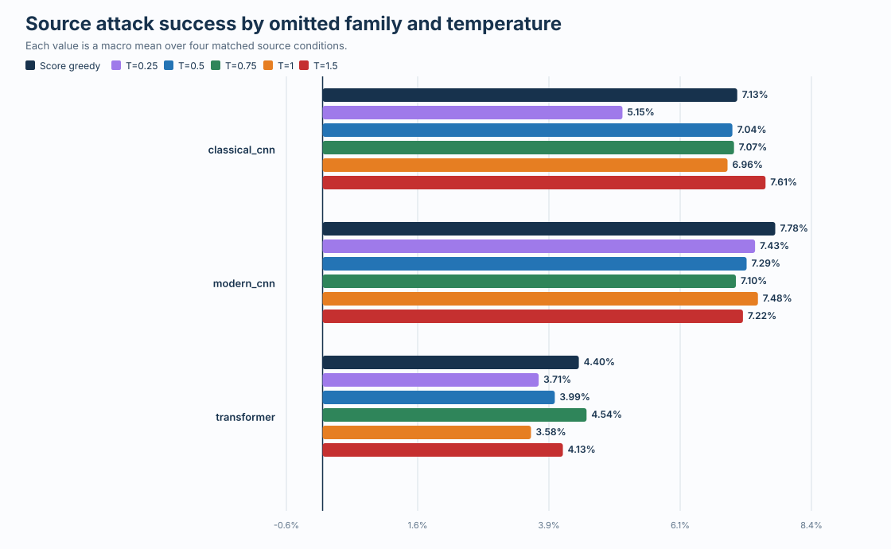

# CIFAR-10 RTX Phase 2 calibration evidence

## Result

The bounded source-only diagnostic completed all three leave-one-family-out folds in 12.34 minutes. It evaluated the frozen Phase 2 checkpoints at temperatures 0.25, 0.50, 0.75, 1.00, and 1.50. Training remained disabled and the hidden-target attack-call count remained **0**.

No temperature matched score-greedy ASR and ASR-query AUC in every fold. The predeclared diagnostic rule therefore stops this five-value global-temperature repair for these frozen seed-17 checkpoints. The diagnostic does not identify the underlying cause. Residual action ranking is an exploratory next candidate, not an established explanation.

| Diagnostic measure | Result |
|---|---:|
| Completed folds | 3 of 3 |
| Temperature-1.0 exact replays | 3 of 3 |
| Raw result rows | 9000 |
| Sampled query traces | 60 |
| Source-model calls | 376142 |
| Hidden-target calls | 0 |
| Qualifying temperatures | 0 |
| Best mean ASR temperature | 1.5 (-0.11 points) |
| Best mean AUC temperature | 0.75 (-0.12 points) |

Score greedy reached 6.435% macro ASR and 2.995% macro AUC.

| Temperature | Macro ASR | ASR gap, points | Macro AUC | AUC gap, points | Folds with observed gaps >= 0 on both | Conditions with observed gaps >= 0 on both |
|---:|---:|---:|---:|---:|---:|---:|
| 0.25 | 5.432% | -1.003 | 2.628% | -0.366 | 0 / 3 | 0 / 12 |
| 0.5 | 6.106% | -0.329 | 2.752% | -0.242 | 0 / 3 | 4 / 12 |
| 0.75 | 6.236% | -0.200 | 2.874% | -0.120 | 1 / 3 | 4 / 12 |
| 1 | 6.007% | -0.429 | 2.683% | -0.312 | 0 / 3 | 1 / 12 |
| 1.5 | 6.321% | -0.114 | 2.810% | -0.185 | 0 / 3 | 4 / 12 |

Temperature 0.75 improved both metrics in the transformer-held-out fold, and temperature 1.50 improved ASR in the classical-CNN-held-out fold. Neither effect was consistent across all three folds and both metrics. Hidden target victims remained sealed, so this is not a transferability result.

## Statistical scope and limitations

- Only one development policy seed was evaluated.
- Each image-victim-temperature combination had one stochastic replay.
- The same 100 source images and overlapping source victims were reused, so the 9,000 rows are dependent observations.
- Five temperatures were selected and evaluated on the same visible source cohort.
- Successes were rare, observed effects were small, and no confidence intervals were estimated; results are descriptive point estimates.
- Only visible source victims were evaluated, so this is not a transfer result.
- No hidden target evaluation was authorized or performed.

## Figures

## Evidence contents

| Artifact | Purpose |
|---|---|
| `summary.json` | Decision, aggregate metrics, integrity facts, runtime, and limitations |
| `temperature_summary.csv` | Mean and worst-fold gains for every temperature |
| `fold_metrics.csv` | Score-greedy and frozen-policy metrics for every fold |
| `condition_metrics.csv` | All 72 matched source-condition method summaries |
| `raw_calibration_records.tar.gz` | Exact verified manifest, 9,000 rows, 60 traces, and sidecars |
| `input_checksums.csv` | Hashes for the copied full-resolution inputs |
| `attempt_log_checksums.csv` | Hashes and sizes for retained execution logs |
| `PROVENANCE.md` | Hardware, code identity, and scope |
| `SHA256SUMS` | Hashes for every published file |

## Next decision

Do not run another grid under this D0 protocol. The next exploratory candidate should preserve score greedy as a fallback and learn only a residual action ranker on visible source victims. A short one-fold D1 screen should be completed before any longer replication is authorized.
