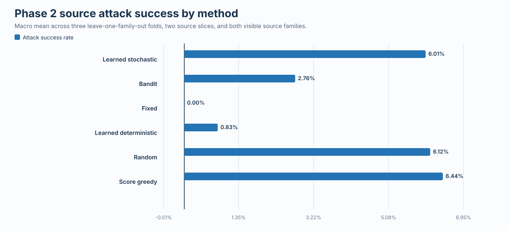
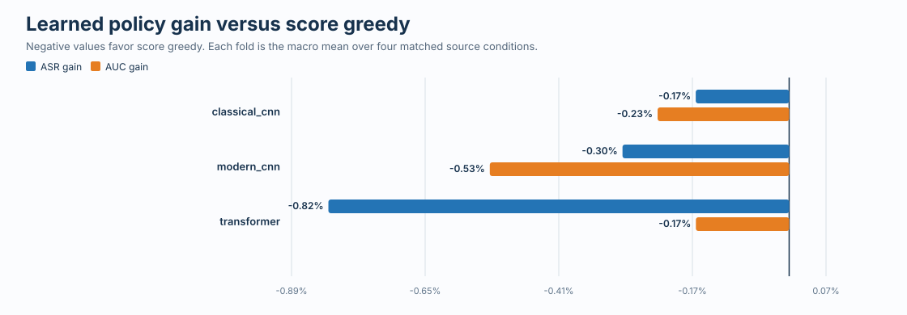
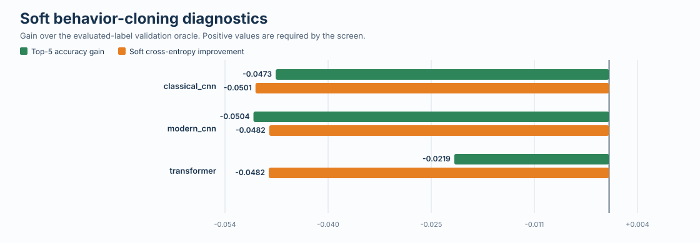
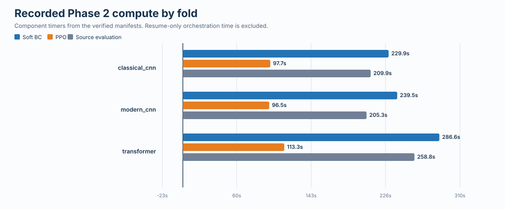

# CIFAR-10 RTX Phase 2 Stage B evidence

## Result

The preregistered source-only Stage B screen **FAILED**. All three leave-one-family-out cells and all 12 matched source conditions completed. The hidden target families remained sealed during each fold, and the total recorded target attack-call count is **0**.

This is a complete negative development result for the tested action-conditioned soft-BC plus PPO candidate. It is not evidence that adversarial attacks transfer across hidden victim families, and it does not authorize target evaluation.

| Locked Stage B measure | Observed | Required |
|---|---:|---:|
| Mean ASR gain over score greedy | -0.0043 | at least +0.0100 |
| Mean ASR-query AUC gain | -0.0031 | at least +0.0050 |
| Mean soft top-5 gain over validation oracle | -0.0399 | at least +0.0100 |
| Mean soft cross-entropy improvement | -0.0488 | at least +0.0200 |
| Conditions positive on both ASR and AUC | 0.0833 | at least 0.6700 |
| Strict source gates passed | 0 of 3 | diagnostic only |

The learned policy produced nonzero attacks, but it did not outperform the matched score-greedy control reliably. The soft behavior-cloning representation also failed its validation-oracle tests. Stage C and hidden-target evaluation were therefore not run.

## Figures

## Evidence contents

| Artifact | Purpose |
|---|---|
| `summary.json` | Machine-readable outcome, aggregate metrics, runtime, and integrity facts |
| `condition_metrics.csv` | Every method result for all 12 source conditions |
| `fold_summary.csv` | Learned and control results grouped by omitted family |
| `bc_diagnostics.csv` | Soft-BC validation results and oracle comparisons |
| `training_blocks.csv` | PPO block diagnostics and recorded source-query use |
| `victim_accuracy.csv` | Clean validation accuracy for every loaded source victim |
| `raw_source_records.tar.gz` | Exact source result rows and sampled query traces |
| `raw_compact_evidence.json.gz` | Portable run manifests, full source metrics, and training diagnostics |
| `input_checksums.csv` | Hashes binding the export to the full local archive |
| `attempt_log_checksums.csv` | Hash and size of each locally retained execution log |
| `SHA256SUMS` | Hashes for every file in this directory |

The raw numerical rows and traces are included. Binary victim and policy checkpoints are not committed to Git. Their SHA-256 identities are preserved in the compact evidence and checksum tables, while the verified full archive remains under `output/rl_transfer/cifar10_rtx_phase2_screen` on the research Mac.

## Runtime and scope

The recorded training and evaluation components total 29.0 minutes across the three folds on an NVIDIA GeForce RTX 2080 Ti. This short screen used one development policy seed, 600 soft-BC episodes, 600 scheduled PPO episodes, and 100 source-evaluation images per cell.

The result supports a narrow conclusion: under this CIFAR-10 victim bank, action space, query budget, and training budget, the tested candidate did not establish source competence beyond score greedy. A new method must be developed and screened entirely on source data before any confirmatory or target access.
