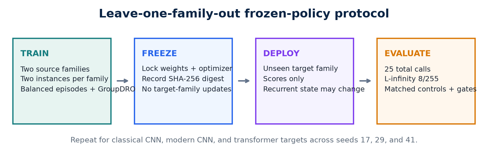
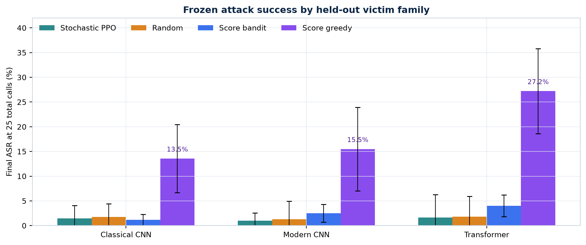
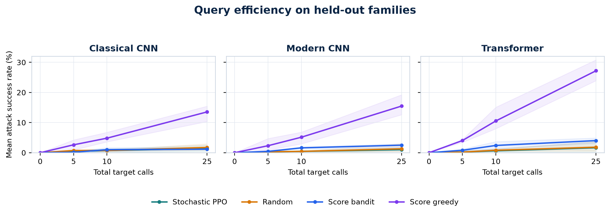
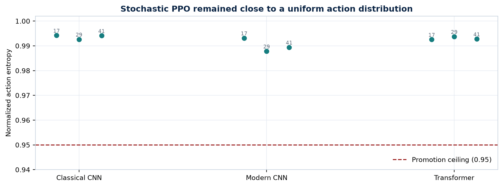

# Evaluating Frozen Cross-Victim RL Attack Policies

## An Exploratory CIFAR-10 Study

**Jeetraj and Prashit**
Summer Research Internship Project, July 2026
Repository: https://github.com/jeetrex17/deeppoly

## Abstract

We evaluate whether a reinforcement-learning attack policy trained against several source image classifiers can be frozen and reused against an unseen architecture family. The transferred object is a sequential policy, not an adversarial example. The method is a recurrent actor-critic trained with Proximal Policy Optimization (PPO), balanced source-family schedules, and Group Distributionally Robust Optimization (GroupDRO). Evaluation uses untargeted, score-based black-box access, 25 total target calls, and a raw-pixel L-infinity bound of 8/255. The leave-one-family-out CIFAR-10 study covers residual classical CNNs, depthwise modern CNNs, and patch transformers over three seeds. Each fold trains a separate policy on the other two families, then evaluates it without parameter updates. All victim-quality and protocol-integrity gates passed. Stochastic PPO obtained mean final attack success rates of 1.45%, 1.01%, and 1.65% on held-out classical, modern, and transformer families. Random action selection obtained 1.74%, 1.29%, and 1.84%, while a score-greedy control obtained 13.55%, 15.49%, and 27.20%. Executed-action entropy remained between 0.988 and 0.994, close to a uniform action histogram. PPO did not outperform random or satisfy the prespecified promotion rule. Within this configuration, score greedy achieved higher ASR over the same patch-direction catalog and overall budgets, but its proposals used a larger per-query step.

**Index Terms:** adversarial examples, black-box attacks, reinforcement learning, policy transfer, PPO, CIFAR-10, query efficiency.

# I. Introduction

Small, norm-bounded input changes can alter the predictions of image classifiers [1], [2]. In white-box attacks, gradients provide a direct optimization signal. Black-box attacks instead rely on model queries, transferred adversarial examples, or learned search procedures. This work considers score-based black-box access: an attacker receives class probabilities for each submitted image but does not receive gradients, parameters, intermediate features, training data, or architecture metadata.

Most transferability research asks whether an adversarial example produced against a surrogate model also fools another classifier. Here the object of transfer is different. We ask whether a persistent sequential policy can learn attack behavior from several source victims and then operate directly against a previously unseen family. The policy may update its recurrent hidden state while querying an image, but its parameters, optimizer state, observation normalization, and action catalog must remain fixed after deployment.

Policy transfer must be evaluated separately from example transfer because target score feedback enters every decision. A valid comparison must prevent target-family data from influencing source training, count every target call, and use identical eligible images and query endpoints.

The study makes four contributions:

1. It defines an explicit frozen-policy transfer setting and separates it from adversarial-example transfer and target adaptation by online fine-tuning.
2. It implements an audited recurrent PPO attack with family-balanced population training, GroupDRO weighting, central perturbation projection, and checkpoint-digest validation.
3. It evaluates nine independently trained policies in a three-family by three-seed leave-one-family-out design against matched random, score-bandit, and score-greedy controls.
4. It records a negative result: the learned policy remains near random, while query-driven greedy search is consistently stronger under the same total target-call budget.

In this experiment, PPO did not outperform the controls on held-out families. Other RL designs and target adaptation were not evaluated.

# II. Related Work

## A. Score-Based Black-Box Attacks

Score-based attacks optimize adversarial inputs using output probabilities or logits. SimBA showed that simple basis-direction proposals can form a strong and query-efficient baseline [3]. A candidate direction is evaluated and retained only when it improves the attack objective. Our score-greedy control follows this accept/reject principle over the same signed patch-direction catalog used by the learned policy. Unlike the policy's 2/255 incremental action, however, each greedy proposal moves directly to the 8/255 boundary. It is custom and SimBA-style; it is not a canonical SimBA-DCT implementation.

Prior evaluation work recommends aligning perturbation constraints, feedback, query accounting, eligible examples, and stopping rules [11], [12]. The present harness counts initialization as a target call, derives all query checkpoints from one trajectory, and validates that every method uses the same clean-correct cohort.

## B. Reinforcement Learning for Adversarial Search

PPO optimizes a clipped policy-gradient objective while fitting a value function [4]. Recurrent PPO is attractive for black-box search because the agent can integrate a sequence of victim responses without changing persistent parameters. Existing RL attacks establish that learned sequential search can generate adversarial inputs. RLAB uses an RL agent with dual actions that add or remove distortion [6]. Adversarial Agents formulates black-box evasion as a Markov decision process [7]. QTRL uses a two-phase RL procedure with hard-sample mining [10]. None of these studies evaluates zero-parameter-update transfer to a held-out architecture family.

RL has also been used to improve adversarial-example transfer. L2T learns transformation sequences that improve transferability [8], while SMER reweights surrogate ensembles to exploit ensemble diversity [9]. In those settings, the transferred product remains an adversarial example or a surrogate-optimization strategy. Our policy is deployed directly against the held-out victim and may react only to the allowed score responses.

## C. Robustness Across Victim Families

Training against a single victim can encourage model-specific behavior. We therefore treat architecture family as a group and use GroupDRO to emphasize poorly performing source families [5]. Model instances are nested within their family rather than treated as independent groups. The intended effect is to discourage the policy from optimizing only for an easier family, although the present experiment does not isolate GroupDRO causally from the other design choices.

# III. Problem Formulation

## A. Threat Model

Let a classifier map an image x in [0,1]^d to a probability vector p(x), and let y denote the true class. The goal of an untargeted attack is to find x_adv such that the predicted label changes while the perturbation remains bounded:

$$ f(x_adv) ≠ y, \qquad ||x_adv - x||∞ ≤ ε. \tag{1} $$

The target returns the full probability vector for each submitted image. The attacker receives the clean image and true label but no gradients, parameters, architecture metadata, or intermediate activations. The total budget is 25 target calls, including the initialization query; therefore an episode can contain at most 24 perturbation proposals. The reported setting uses epsilon = 8/255.

## B. Transfer Settings

We distinguish four transfer settings:

**Table I. Policy-transfer taxonomy.**

| Setting | Target feedback | Parameter updates | Interpretation |
| --- | --- | --- | --- |
| T0 | None | None | Query-free adversarial-example or generator transfer |
| T1 | Scores | None | Frozen policy with recurrent in-episode context |
| T2 | Top-1 label | None | Frozen decision-based policy |
| T3 | Declared feedback | Limited updates | Target adaptation by online fine-tuning |

The final CIFAR-10 experiment evaluates T1. Recurrent hidden state changes are permitted within an episode, but all persistent policy state remains fixed. An earlier DQN scaffold implements T3 by cloning a source policy and updating only the clone on a disjoint adaptation subset. That branch validates the software mechanism at smoke-test level; it is not part of the empirical claims in this paper.

## C. Research Question and Decision Rule

The primary question is whether a policy trained on source classifier families and frozen can outperform matched non-learning controls on completely held-out families. The main metrics are final attack success rate (ASR) and area under the ASR-versus-query curve (ASR/query AUC).

The evaluation uses a fail-closed promotion rule. The full family-seed grid and all victim gates must pass. Stochastic PPO must improve both final ASR and AUC over random action selection, the score bandit, and score greedy; paired 95% confidence-interval lower bounds must be positive; mean improvements must exceed 1 percentage point in ASR and 0.5 percentage point in AUC; and every seed's normalized executed-action entropy must lie in [0.10, 0.95]. The rule was fixed before the final study results were interpreted.

# IV. Method

## A. Victim Population and Data

The population contains three custom CIFAR-scale families: a residual classical CNN, a depthwise/inverted-residual modern CNN, and a patch transformer. The architectures are summarized in Table II. These are not standard ResNet, ConvNeXt, or ViT benchmark checkpoints.

**Table II. Implemented victim families.**

| Family | Architecture summary | Research profile |
| --- | --- | --- |
| Classical CNN | Residual CNN | Widths 64/128/256; two blocks per stage; dropout 0.1 |
| Modern CNN | Depthwise/inverted residual | Widths 48/72/144/256; blocks 2/2/3; expansion 3; dropout 0.1 |
| Transformer | Patch transformer | Patch 4x4; width 96; depth 3; four heads; CLS pooling; dropout 0.1 |

For each seed, class-stratified subsets contain 10,000 victim-training images, 1,000 policy-training images, 1,000 source-validation images, and 300 official-test images. Victims are fitted for 12 epochs with AdamW, cosine learning-rate scheduling, random reflected crop and horizontal-flip augmentation, cross-entropy loss, and gradient clipping. Two independently seeded victim instances represent each source family. One independently trained instance from the held-out family is used as the target.

## B. Observation and Recurrent Policy

At each step, the policy receives an eight-dimensional observation: normalized true-class rank; normalized predictive entropy; normalized change in the true-class score from initialization; current true-class margin over the strongest rival; fraction of query budget remaining; normalized previous-action identifier; hyperbolic tangent of the previous reward; and episode progress.

The policy applies a linear tanh encoder, a GRUCell with hidden size 96, an actor head over 96 discrete actions, and a scalar critic. The hidden state is reset for every image. It changes as target responses arrive but is not retained across episodes.

## C. Action Space and Projection

The 32x32 image is divided into a 4x4 patch grid. An action selects one of 16 patches, one of three channels, and one sign, producing 96 signed patch actions. The selected channel-patch region changes by 2/255. Every candidate is centrally projected into the permitted raw-pixel ball:

$$ x_(t+1) = clip_[0,1]( clip_[x-ε,x+ε](x_t + δ(a_t)) ). \tag{2} $$

Central projection prevents an attack implementation from silently violating the constraint. Victim normalization occurs inside the model so that the perturbation bound remains defined in raw pixel space.

## D. Reward, PPO, and GroupDRO

Let m_t = p_y(x_t) - max_(j != y) p_j(x_t) be the true-class margin after query t. The dense reward is

$$ r_t = 5(m_(t-1) - m_t) + 2 I[f(x_t) ≠ y] - 0.01. \tag{3} $$

The margin-difference term rewards incremental progress, the indicator rewards actual misclassification, and the constant penalizes each query. PPO uses learning rate 3e-4, clipping ratio 0.2, value-loss weight 0.5, entropy weight 0.01, gradient-norm clipping at 0.5, four update epochs per collection block, and return discount 0.98. Advantages are normalized over the collected source sequences.

Source families are scheduled in balanced randomized cycles, while instances rotate within each family. After a block, negative family return forms the GroupDRO loss and family weights are updated multiplicatively. Sequence weights are normalized by both family weight and the number of trainable sequences for that family.

## E. Frozen Evaluation Boundary

Each held-out family and seed receives a separately trained checkpoint; the study therefore contains nine fold-specific policies rather than one universal checkpoint. Before target evaluation, a SHA-256 digest covers the model state, optimizer state, and PPO configuration. The same digest is recomputed after each evaluation and a mismatch raises an error. Target images cannot affect training rewards, early stopping, architecture selection, or hyperparameters for their fold.

# V. Experimental Design

## A. Leave-One-Family-Out Protocol

The complete grid consists of three held-out families multiplied by seeds 17, 29, and 41. In each fold, the other two families supply four source instances in total. The target fold begins only after the fold-specific policy is frozen. Across all seeds, the repository stores 18 unique victim checkpoints.

Attack success is computed only over images correctly classified by the target before attack. The eligible sample identities are hashed and shared by all methods in a run. ASR at total budgets 0, 5, 10, and 25 is derived from one trajectory rather than separate reruns. All failed calls, initialization calls, and ordinary proposals count against the same total budget.

## B. Baselines

The primary comparisons are:

- **Random action:** uniformly samples from the same 96 actions.
- **Score bandit:** uses episode-local UCB statistics from previous rewards but carries no state across images.
- **Score greedy:** randomizes the same patch-direction catalog per image, proposes a signed patch directly at the 8/255 boundary, and retains the proposal only when the confidence margin improves. Its per-proposal magnitude is therefore larger than PPO's 2/255 action step.

Deterministic PPO and a fixed-action control are also recorded but are secondary. Score greedy is matched on target-call budget, eligible cohort, final perturbation bound, and patch directions while making an explicit query-driven accept/reject decision; it is not matched on per-proposal magnitude.

## C. Integrity and Reproducibility Controls

The final run used Python 3.13.11, PyTorch 2.13.0, torchvision 0.28.0, macOS 15.7.3 arm64, and the Apple M4 MPS backend. Split, configuration, source code, checkpoint, victim-cache, and eligible-cohort digests are recorded. Checkpoint writes are atomic and cache reuse requires exact contract matches. The current repository verification contains 76 passing tests, 12 passing subtests, and 87.75% line coverage. PyTorch reports one MPS operation without a deterministic implementation; exact checkpoint digests therefore define artifact identity more reliably than seeds alone.

# VI. Results

## A. Execution and Victim Quality

The final study scheduled 5,400 policy episodes, produced 3,640 trainable clean-correct sequences, and recorded 91,800 source-model calls. Evaluation covered 1,859 clean-correct target image/run cases per method. The complete run took 6,864.9 seconds (114.4 minutes) on the Apple M4.

All victim gates passed. Validation accuracy ranged from 73.4% to 74.4% for the classical CNN, 73.3% to 76.2% for the modern CNN, and 51.1% to 56.3% for the transformer. Target-test accuracy ranged from 73.3% to 78.7%, 70.7% to 79.3%, and 53.0% to 58.3%, respectively. Transformer accuracy was lower than CNN accuracy, which limits external validity; all models nevertheless exceeded the configured victim-quality thresholds.

## B. Attack Success

Table III reports the across-seed mean final ASR and Student-t 95% interval. Stochastic PPO did not improve on random action selection in any family. Score greedy achieved higher mean ASR in all three held-out families.

**Table III. Final ASR (%) at 25 total target calls; mean [95% interval] over three seeds.**

| Held-out family | Stochastic PPO | Random | Score bandit | Score greedy |
| --- | --- | --- | --- | --- |
| Classical CNN | 1.45 [0.00, 4.05] | 1.74 [0.00, 4.43] | 1.17 [0.04, 2.30] | 13.55 [6.65, 20.45] |
| Modern CNN | 1.01 [0.00, 2.59] | 1.29 [0.00, 4.95] | 2.50 [0.72, 4.28] | 15.49 [7.05, 23.92] |
| Transformer | 1.65 [0.00, 6.29] | 1.84 [0.00, 5.90] | 4.02 [1.83, 6.21] | 27.20 [18.61, 35.79] |

Pooled descriptively over all nine runs, stochastic PPO succeeded on 25/1,859 eligible cases, random on 30/1,859, score bandit on 45/1,859, and score greedy on 333/1,859. The equal-seed family aggregates in Table III are the primary comparison because pooling gives unequal weights to runs with different eligible counts.

## C. Query Efficiency and Action Entropy

Mean ASR/query AUC was 0.81%, 0.53%, and 0.78% for stochastic PPO on classical, modern, and transformer targets. Random obtained 0.96%, 0.62%, and 0.91%; score bandit obtained 0.79%, 1.48%, and 2.33%; and score greedy obtained 6.52%, 7.17%, and 13.19%. PPO's ASR/query AUC was close to random in all three families.

Normalized executed-action entropy for stochastic PPO ranged from 0.988 to 0.994 across the nine runs. A value of 1.0 corresponds to an approximately uniform empirical action histogram. This diagnostic concerns executed actions, not the exact categorical entropy of the actor logits. Every fold exceeded the prespecified ceiling of 0.95.

## D. Promotion Outcome

Every family failed the promotion rule. The family-seed grid was complete, victim gates passed, policies remained frozen, and cohort and query-budget checks aligned. The measured ASR, AUC, and entropy values caused the failures.

# VII. Discussion

The target results motivate two hypotheses: weak source-task learning and loss of transfer at deployment. This experiment cannot distinguish them. Score greedy reached 13.55% to 27.20% mean ASR with the same patch directions, perturbation bound, images, and query budget, but used 8/255 proposals instead of PPO's 2/255 steps. It therefore shows that query-driven patch search works in this setting, not that PPO failed under an identical action operator.

Possible causes include the 96-way flat action catalog, the absence of visual region features in the eight-dimensional observation, rare successful source attacks, and an entropy bonus that may be large relative to the advantage signal. Dense margin reduction rewards local progress but does not teach the accept/reject rule used by score greedy. Matched ablations are required because reward shaping, victim capacity, source multiplicity, controls, and reproducibility logic changed together between the pilot and final experiment.

The next experiment should diagnose learning before scaling compute. Each checkpoint should be evaluated on (i) the exact source instances used for training, (ii) independently initialized instances from a seen family, and (iii) the held-out family. Failure at level (i) would show that transfer is not yet the bottleneck. Success at (i) but failure at (ii) would indicate instance-specific behavior. Success through (ii) but failure at (iii) would isolate a genuine architecture-family shift.

A direct next test is behavioral cloning from score-greedy source trajectories. The actor can first learn accepted source actions under the existing representation, then be fine-tuned with PPO. A small diagnostic should require imitation accuracy above the 1/96 random level, source-victim ASR at least five percentage points above random, positive source AUC difference, and entropy below 0.95 without collapsing to a fixed action. Hierarchical actions and a lightweight image-region encoder should be tested only after this learning gate passes.

# VIII. Limitations and Responsible Use

This is an exploratory CIFAR-10 study with three seeds and custom compact victims. It does not include ImageNet, standard pretrained architecture families, multiple target instances per family and seed, robust models, label-only feedback, targeted attacks, 4/255 perturbations, 100- or 500-call budgets, LPIPS analysis, or established Square Attack, SimBA-DCT, NES, and HopSkipJump baselines. Student-t intervals over three seeds are descriptive and do not replace the planned hierarchical bootstrap, paired permutation tests, and multiplicity correction. The relatively low transformer accuracy further limits external validity.

The empirical paper covers frozen T1 deployment only. The earlier cloned DQN branch demonstrates how T3 target adaptation by online fine-tuning can be isolated without overwriting the source policy, but no final scientific comparison between frozen deployment and target adaptation was run. Sequential-task retention and forgetting were not measured, so it would be inaccurate to present continual learning as an evaluated result.

The repository is intended for authorized defensive robustness research. Experiments should use public benchmarks or systems owned by or explicitly available to the researcher. Rate limits, query costs, and service terms must be respected. Pretrained attack policies require additional dual-use review because a reusable policy could reduce the cost of probing unknown deployed models.

# IX. Conclusion

Across nine runs, PPO remained close to random and failed the promotion rule; score-greedy patch search achieved higher ASR. The frozen-policy checks, matched cohorts, and query accounting are now available for source-task diagnostics, behavioral-cloning initialization, hierarchical actions, and controlled ablations.

# Reproducibility Statement

The final experiment configuration is stored in `configs/rl_transfer/cifar10_m4_study.json`, with per-run settings in `configs/rl_transfer/cifar10_m4_iteration.json`. Compact verified results are in `docs/research/cifar10_m4_study_results.json`; interactive analysis is in `notebooks/cifar10_m4_study.ipynb`; and the responsible-use boundary is documented in `MODEL_CARD_RL_ATTACK.md`. The final study code revision is `2eb481a`, and the published result artifacts were committed in `9453730`.

# References

[1] C. Szegedy et al., "Intriguing Properties of Neural Networks," in Proc. ICLR, 2014, arXiv:1312.6199.

[2] I. J. Goodfellow, J. Shlens, and C. Szegedy, "Explaining and Harnessing Adversarial Examples," in Proc. ICLR, 2015, arXiv:1412.6572.

[3] C. Guo, J. Gardner, Y. You, A. G. Wilson, and K. Q. Weinberger, "Simple Black-box Adversarial Attacks," in Proc. ICML, PMLR, vol. 97, pp. 2484-2493, 2019.

[4] J. Schulman, F. Wolski, P. Dhariwal, A. Radford, and O. Klimov, "Proximal Policy Optimization Algorithms," arXiv:1707.06347, 2017.

[5] S. Sagawa, P. W. Koh, T. B. Hashimoto, and P. Liang, "Distributionally Robust Neural Networks for Group Shifts: On the Importance of Regularization for Worst-Case Generalization," in Proc. ICLR, 2020.

[6] S. Sarkar et al., "Reinforcement Learning Platform for Adversarial Black-box Attacks with Custom Distortion Filters," in Proc. AAAI, vol. 39, no. 26, pp. 27628-27635, 2025, doi:10.1609/aaai.v39i26.34976.

[7] K. Domico, J.-C. Noirot Ferrand, R. Sheatsley, E. Pauley, J. Hanna, and P. McDaniel, "Adversarial Agents: Black-Box Evasion Attacks with Reinforcement Learning," arXiv:2503.01734, 2025.

[8] R. Zhu, Z. Zhang, S. Liang, Z. Liu, and C. Xu, "Learning to Transform Dynamically for Better Adversarial Transferability," in Proc. CVPR, pp. 24273-24283, 2024.

[9] B. Tang, Z. Wang, Y. Bin, Q. Dou, Y. Yang, and H. T. Shen, "Ensemble Diversity Facilitates Adversarial Transferability," in Proc. CVPR, pp. 24377-24386, 2024.

[10] Z. Ma and T. Feng, "Query-Efficient Two-Phase Reinforcement Learning Framework for Black-Box Adversarial Attacks," Symmetry, vol. 17, no. 7, art. 1093, 2025, doi:10.3390/sym17071093.

[11] X. Wang et al., "Devling into Adversarial Transferability on Image Classification: Review, Benchmark, and Evaluation," arXiv:2602.23117, 2026.

[12] Z. Zhao et al., "Revisiting Transferable Adversarial Image Examples: Attack Categorization, Evaluation Guidelines, and New Insights," arXiv:2310.11850, 2023.

[13] A. Krizhevsky, "Learning Multiple Layers of Features from Tiny Images," Technical Report, University of Toronto, 2009.
